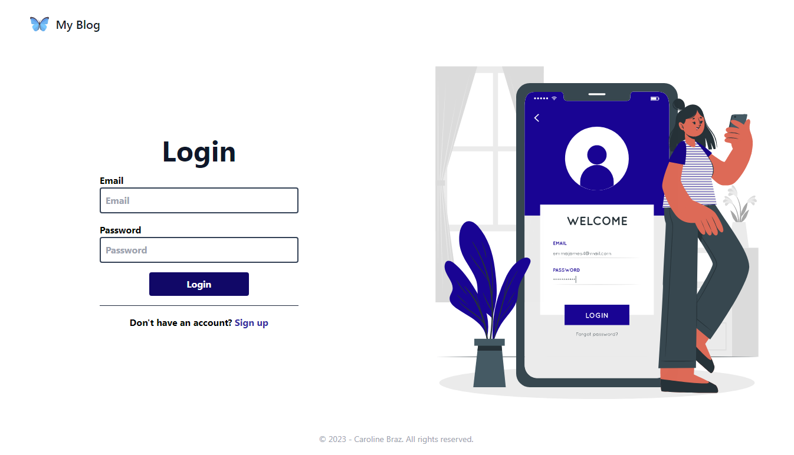
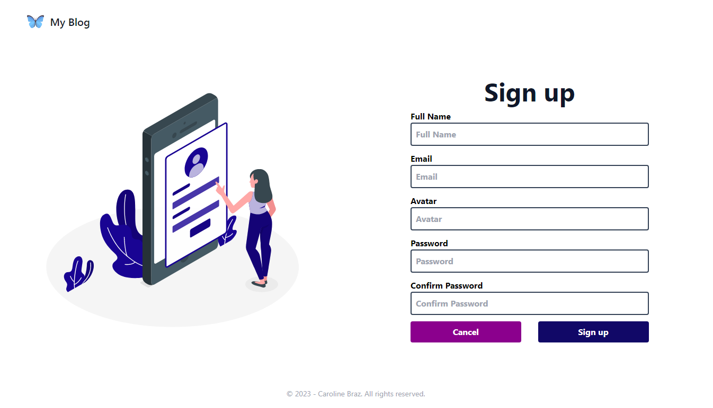
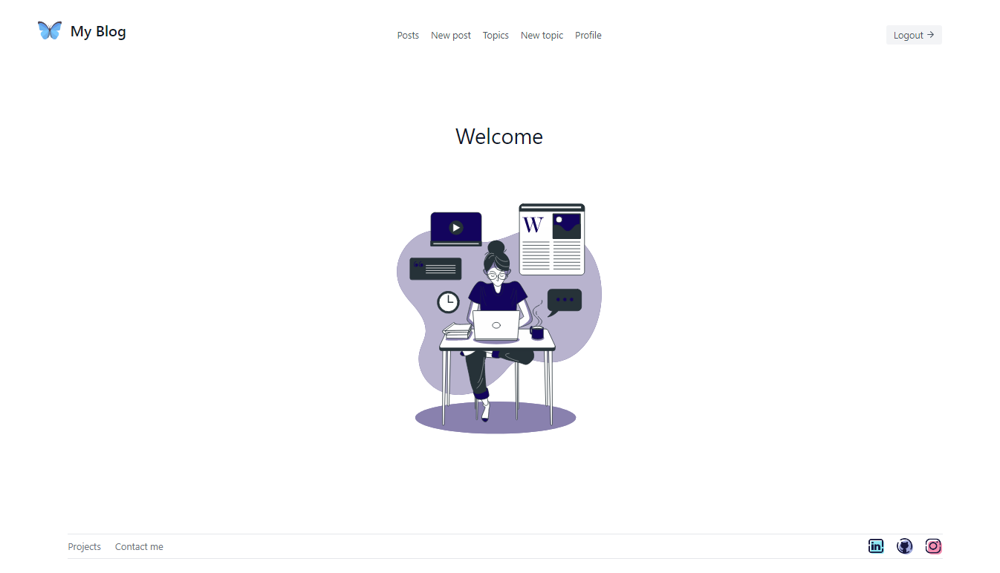
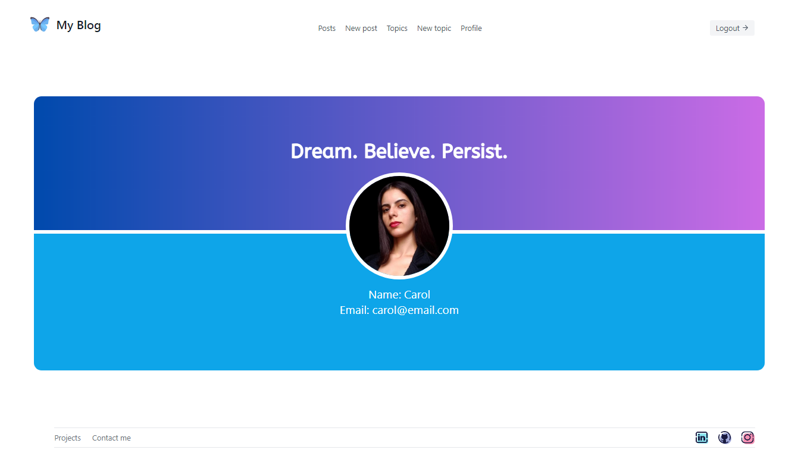
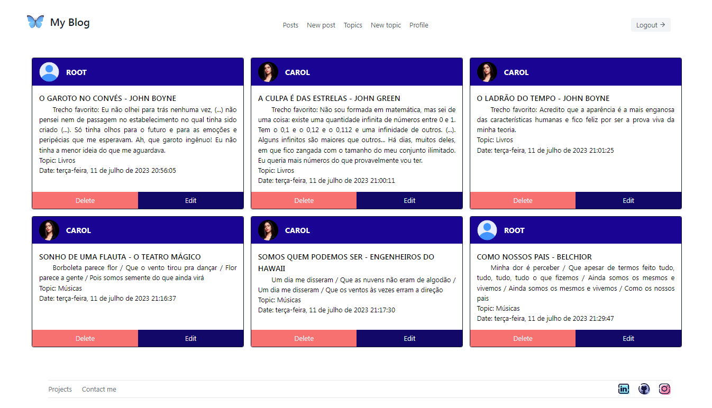

<h5 align="right">
	This file is also available in <a href=https://github.com/carolinebraz/my-blog-app/blob/main/README.md> English </a> :us:
</h5>

# <p align="center"> My Blog :pencil: </p>

Front-end do projeto Blog Pessoal desenvolvido em `React + Typescript + Vite` durante o curso de Desenvolvimento Web Full Stack da Generation Brasil.

• [Funcionalidades](#funcionalidades-sparkles)
• [Imagens](#imagens-art)
• [Requisitos](#requisitos-warning)
• [Tecnologias](#tecnologias-computer)
• [Executando o aplicativo](#executando-o-aplicativo-arrow_forward)
• [Deploy](#deploy-rocket)
• [Licença](#licença-lock)

### Funcionalidades :sparkles:  
- [x]  Cadastro e autenticação de usuário
- [x]  Cadastro, edição e exclusão de temas e postagens
- [x]  Feed de temas e postagens
- [x]  Página de perfil do usuário

### Imagens :art:  
Login | Cadastro | Home | Perfil | Postagens
:---:|:---:|:---:|:---:|:---:
 |  |  |  | 

Para mais detalhes, acesse: [My Blog Project](https://my-blog-app-lilac.vercel.app/)

### Requisitos :warning: 
Para o desenvolvimento é necessário instalar em sua máquina uma ferramenta de versionamento de código, um ambiente de execução JavaScript e um editor de código.

- [Git](https://git-scm.com/)
- [Nodejs ^ 17.9.1](https://nodejs.org/en/)
- [VSCode](https://code.visualstudio.com/)

### Tecnologias :computer:
- [React ^ 18.2.0](https://react.dev/)
- [Typescript ^ 5.0.2](https://www.typescriptlang.org/)
- [Vite ^ 4.4.5](https://vitejs.dev/) 
- [Axios](https://axios-http.com/ptbr/docs/intro)
- [React Router DOM](https://www.npmjs.com/package/react-router-dom)
- [React Loader Spinner](https://www.npmjs.com/package/react-loader-spinner)
- [React Toastify](https://www.npmjs.com/package/react-toastify)
- [Tailwind CSS](https://tailwindcss.com/)

### Executando o aplicativo :arrow_forward:  
1. Clone o projeto  

    ```
    git clone https://github.com/carolinebraz/my-blog-app.git  
    ```

2. Instale as dependências  

    ```
    yarn  
    ```

3. Inicie a aplicação  

    ```
    yarn run dev   
    ```

4. Navegue para o localhost do projeto  
	- [http://localhost:5173/](http://localhost:5173/)

### Deploy :rocket:
Esse projeto encontra-se temporariamente hospedado de forma gratuita nos servidores do [Vercel](https://vercel.com/) e do [Render](https://render.com/).

- Front end: [https://my-blog-app-lilac.vercel.app/](https://my-blog-app-lilac.vercel.app/)
- Back end: [https://myblog-bfkt.onrender.com/](https://myblog-bfkt.onrender.com/)

### Licença :lock:
Copyright &copy; 2023 - Caroline Braz

[Licença MIT](./LICENSE)
