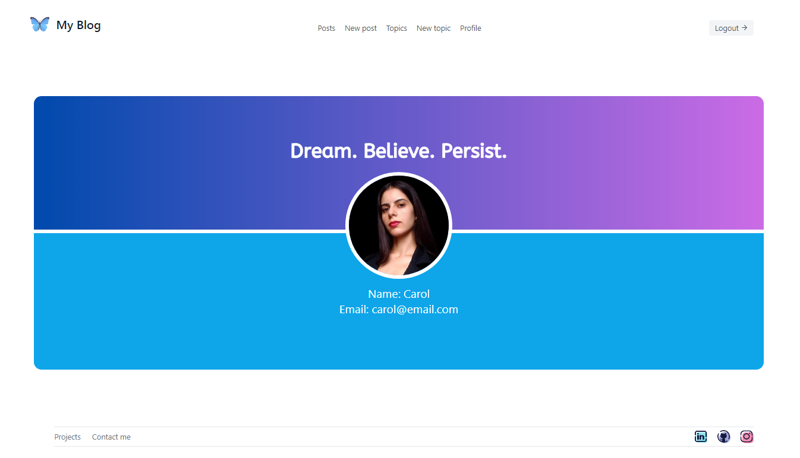
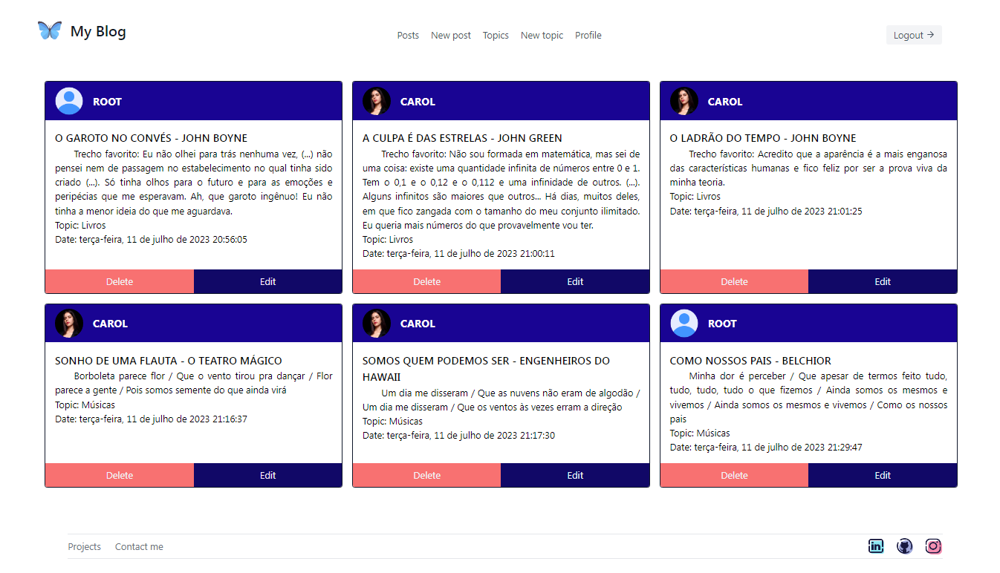

<h5 align="right">
	Este arquivo também está disponível em <a href=https://github.com/carolinebraz/my-blog-app/blob/main/README-pt.md> Português </a> :brazil: 
</h5>

# <p align="center"> My Blog :pencil: </p>

Front-end of the Personal Blog project developed using `React + Typescript + Vite` during the Full Stack Web Development course at Generation Brazil.

• [Features](#features-sparkles)
• [Layout](#layout-art)
• [Prerequisites](#prerequisites-warning)
• [Technologies](#technologies-computer)
• [Run](#run-arrow_foward)
• [Deploy](#deploy-rocket)
• [License](#license-lock)

### Features :sparkles:  
- [x] User registration and authentication
- [x] Registration, editing, and deletion of themes and posts
- [x] Feed of themes and posts
- [x] User profile page

### Layout :art:  
Login | Sign up | Home | Profile | Posts
:---:|:---:|:---:|:---:|:---:
 |  |  |  | 

For more details, please visit: [My Blog Project](https://my-blog-app-lilac.vercel.app/)

### Prerequisites :warning: 
For development, you will need to have installed on your machine a code versioning tool, a JavaScript runtime environment, and a code editor. 
- [Git](https://git-scm.com/)
- [Nodejs ^ 17.9.1](https://nodejs.org/en/)
- [VSCode](https://code.visualstudio.com/)

### Technologies :computer:
- [React ^ 18.2.0](https://react.dev/)
- [Typescript ^ 5.0.2](https://www.typescriptlang.org/)
- [Vite ^ 4.4.5](https://vitejs.dev/) 
- [Axios](https://axios-http.com/ptbr/docs/intro)
- [React Router DOM](https://www.npmjs.com/package/react-router-dom)
- [React Loader Spinner](https://www.npmjs.com/package/react-loader-spinner)
- [React Toastify](https://www.npmjs.com/package/react-toastify)
- [Tailwind CSS](https://tailwindcss.com/)

### Run :arrow_forward:  
1. Clone the project  

    ```
    git clone https://github.com/carolinebraz/my-blog-app.git  
    ```

2. Install the dependencies  

    ```
    yarn  
    ```

3. Run the app  

    ```
    yarn run dev   
    ```

4. Go to the project's localhost  
	- [http://localhost:5173/](http://localhost:5173/)

### Deploy :rocket:
This project is temporarily hosted for free on the servers of [Vercel](https://vercel.com/) and [Render](https://render.com/).

- Front end: [https://my-blog-app-lilac.vercel.app/](https://my-blog-app-lilac.vercel.app/)
- Back end: [https://myblog-bfkt.onrender.com/](https://myblog-bfkt.onrender.com/)

### License :lock:
Copyright &copy; 2023 - Caroline Braz

[MIT License](./LICENSE)
